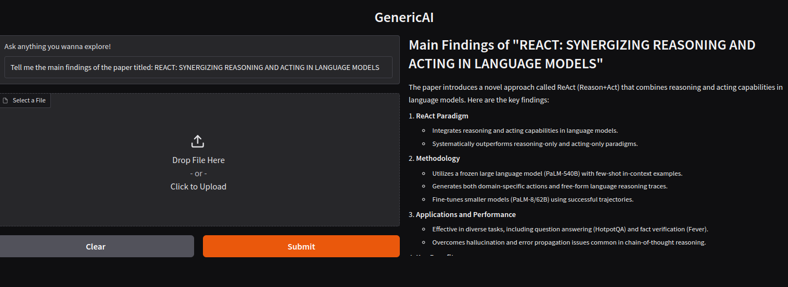

# GenericAI: A ReAct-Based Intelligent Assistant

GenericAI is a versatile AI assistant developed using the ReAct (Reasoning and Acting) framework. It leverages [LangChain](https://langchain.com/) for coordinating language model interactions and [Gradio](https://gradio.app/) for an intuitive interface. With a variety of integrated tools, GenericAI is capable of reasoning through complex queries and executing actions to deliver accurate and well-rounded responses.

## Table of Contents

- [Features](#features)
- [Demo](#demo)
- [Installation](#installation)
  - [Prerequisites](#prerequisites)
  - [Setup](#setup)
- [Configuration](#configuration)
- [Usage](#usage)
  - [Running the Application](#running-the-application)
  - [Interacting with GenericAI](#interacting-with-genericai)
- [Tools](#tools)
- [Contributing](#contributing)
- [License](#license)
- [Acknowledgements](#acknowledgements)

## Features

- **ReAct Framework**: Uses reasoning and acting to address complex queries.
- **Integrated Tools**: Includes Python REPL, Terminal, Weather API, Web Browsing, PDF Summarization, Image Description, and more.
- **Chat History Management**: Tracks conversations with MongoDB for contextual responses.
- **User-Friendly Interface**: Built with Gradio for easy interaction.
- **Extensible Architecture**: Add or modify tools with minimal effort.

## Demo

 <!-- Replace with a demo GIF or screenshot -->

Run the application locally to experience GenericAI in action. Submit questions, provide files, and see how it intelligently uses tools to respond.

## Installation

### Prerequisites

- **Python 3.12**: Install from [python.org](https://www.python.org/downloads/).
- **MongoDB**: Use [MongoDB Atlas](https://www.mongodb.com/cloud/atlas) for cloud or install locally.
- **Git**: Required to clone the repository.

### Setup

1. **Clone the Repository**

   ```bash
   git clone https://github.com/shaswata56/GenericAI.git
   cd GenericAI
   ```

2. **Create a Virtual Environment**

   Use a virtual environment to manage dependencies.

   ```bash
   python3 -m venv venv
   source venv/bin/activate  # On Windows: venv\Scripts\activate
   ```

3. **Install Dependencies**

   ```bash
   pip install --upgrade pip
   pip install -r requirements.txt
   ```

## Configuration

1. **Environment Variables**

   This repository includes a pre-configured `.env` file. However, when you use it, ensure that you add `.env` to your `.gitignore` to avoid exposing sensitive information. Below is the default content of the `.env` file:

   ```env
   OPENROUTER_API_KEY="your-api-key"
   TOGETHER_API_KEY="your-api-key"
   OPENWEATHERMAP_API_KEY="your-api-key"
   TAVILY_API_KEY="your-api-key"
   MONGODB_URL="mongodb://localhost:27017/"
   LLM_PROVIDER="ollama"
   LLM_MODEL="llava:13b"
   VLM_PROVIDER="ollama"
   VLM_MODEL="llava:13b"
   ```

   Update the values in the `.env` file with your actual API keys and configuration as needed.

2. **API Keys**

   Obtain API keys for tools like OpenWeatherMap, Tavily, and PubMed, and update the `.env` file accordingly.

## Usage

### Running the Application

Activate the virtual environment if it isn't active:

```bash
source venv/bin/activate  # On Windows: venv\Scripts\activate
```

Start the application:

```bash
python GenericAI.py
```

The Gradio interface will provide a local URL (e.g., `http://127.0.0.1:5656`). Open the URL in your browser to interact with GenericAI.

### Interacting with GenericAI

1. **Ask a Question**: Enter your query in the text box.
2. **Upload a File (Optional)**: Upload a file (e.g., PDF, image) for processing.
3. **View Response**: The response will appear in the markdown output area.

**Example Queries:**

- "Summarize the attached PDF."
- "What is the weather like in New York?"
- "Describe the image in the uploaded file."
- "Count the number of vowels in the word 'OpenAI'."

## Tools

GenericAI includes various tools for enhanced functionality:

### Core Tools

- **Python REPL**: Execute Python commands.
- **Terminal**: Run shell commands.
- **Weather**: Fetch weather data using OpenWeatherMap.
- **Search**: Perform web searches.
- **Calculator**: Solve math problems.
- **Wikipedia**: Access general knowledge.
- **YouTube**: Retrieve YouTube video links.
- **Arxiv**: Search for scientific articles on [arXiv](https://arxiv.org/).
- **DateTimeNow**: Display the current date and time.

### Specialized Tools

- **LetterInWordCounter**: Count occurrences of a letter in a word.
- **WebpageBrowser**: Summarize webpage content.
- **PubMed**: Query medical information.
- **RecallMemory**: Retrieve past conversations.
- **VowelCounter**: Count vowels in a string.
- **TotalLetterCounter**: Count letters in a string.
- **PdfSummarizer**: Summarize PDF files.
- **ImgDesc**: Describe images.
- **ImgDescOnline**: Describe online images.
- **TxtFileReader**: Read text files.
- **TxtFileWriter**: Overwrite text files.
- **TxtFileAppender**: Append to text files.
- **PdfReader**: Read PDF files.
- **PdfReaderOnline**: Read online PDFs.
- **Notepad**: Simple notepad functionality.

### Adding Custom Tools

Define new tools and register them in the `get_tools` function in `GenericAI.py`. Ensure each tool adheres to input-output standards for smooth integration.

## Contributing

Contributions are welcome! Follow these steps to contribute:

1. **Fork the Repository**

   Click the "Fork" button at the top right of this page.

2. **Clone the Forked Repository**

   ```bash
   git clone https://github.com/shaswata56/GenericAI.git
   cd GenericAI
   ```

3. **Create a Feature Branch**

   ```bash
   git checkout -b feature/YourFeatureName
   ```

4. **Commit Your Changes**

   ```bash
   git commit -m "Add Your Feature"
   ```

5. **Push to the Branch**

   ```bash
   git push origin feature/YourFeatureName
   ```

6. **Open a Pull Request**

   Navigate to your forked repository on GitHub and click "Compare & pull request".

## License

This project is licensed under the [MIT License](LICENSE).

## Acknowledgements

- [LangChain](https://langchain.com/) for its powerful framework for language model applications.
- [Gradio](https://gradio.app/) for its user-friendly interface creation tools.
- [MongoDB](https://www.mongodb.com/) for scalable storage of chat histories.

---

